# Song Generator

## Contents
* [Introduction](#Introduction)
* [Design](#Design)
    * [Risk Assessment](#Risk-Assessment)
    * [Trello Board](#Trello-Board)
    * [Application Diagram](#Application-Diagram)
    * [CI Pipeline](#CI-pipeline)
* [Development](#Development)
* [Review](#Review)

---
## __Introduction__

The objective of this project is to create a service-orientated architecture for my application, creating four services that work together. As well as two iterations of the three services used to create information.

_Service 1:_
* The application that users will interact with, which will be a simple page displaying the information pulled from the other services.

_Service 2:_
* This service will simply generate an artist or an album from a list and return it.

_Service 3:_
* This service will generate a random string of characters with a different length depending on the iteration.

_Service 4:_
* This service will generate a song based on the information generated from Service 2 and Service 3.

I will be creating these different implementations as different versions of the application to demonstrate how a rolling update can be performed.

I'll be using a variety of tools during the design process, as well as CI/CD tools to ensure that the application can be deployed easily without requiring further configuration.

---
## __Design__
### __Risk Assessment__
Here is the first draft of my risk assessment, showing all the potential issues I could run into during development of the project, I plan to add other issues, and review the solutions I decided to implement once the project is finished.

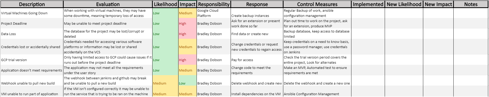

The full risk assessment can be found [here](https://qalearning-my.sharepoint.com/:x:/g/personal/bdobson_qa_com/EVedzs3PfnVDh8thRQIWPDwBybsifzJtpsUZghWReMfN9Q?e=lHYxoL)

---
### __Trello Board__
Once again I decided to use Trello to track my progress during the project.

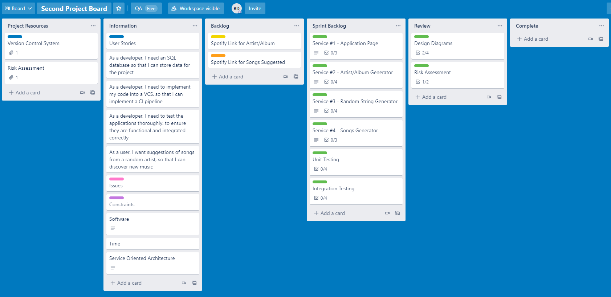

The complete board can be found [here](https://trello.com/b/Ptseqgzs)

---
### __Application Diagram__
I decided to create an application diagram, to show how the different services will interact to create the application. 

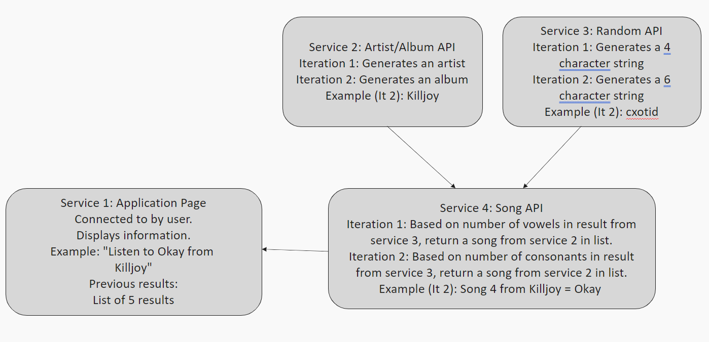

---
### __CI pipeline__
Finally, I created a diagram to show the CI pipeline I plan to create with the application.

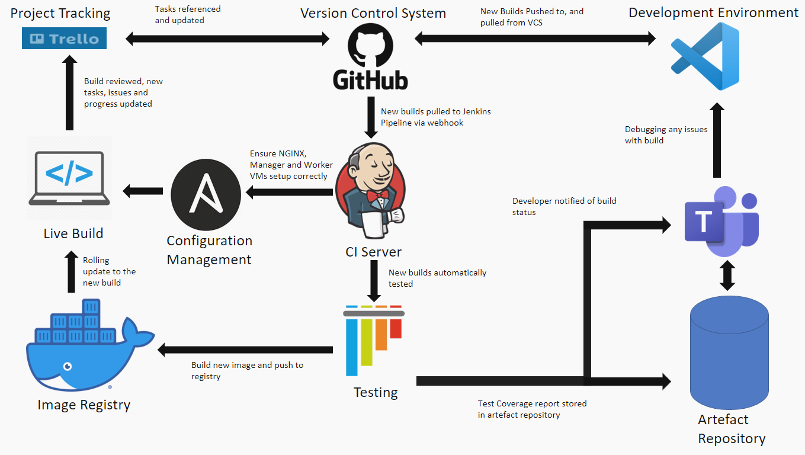

---
## __Development__
### __Test Analysis__
I wrote testing for the application to cover each API that is used, and the server that the user will access. 

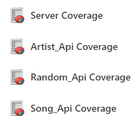

Each part of the application, I tried to get the majority of the functions tested to ensure it functioned as expected.

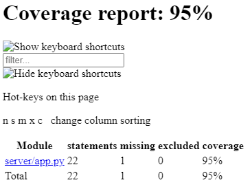

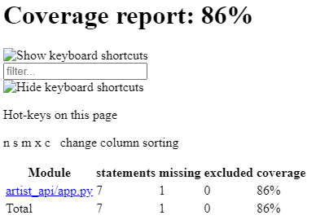

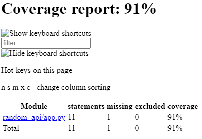

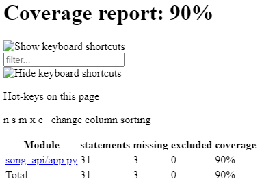

One line that isn't covered in each application is the app.run line, as testing this isn't really necessary because if this line didn't function correctly, the application would fail in an area. The song API has a small function that isn't covered under the testing, however this is used in the main function, and if it was incorrect, then the testing that is included would fail, therefore I decided it was covered in the scope of my testing.

In the future I could implement some integration testing, however with how the MVP is created, there isn't anything for the user to interact with other than reloading the page, so it would be very basic and not provide a useful result.

### __Build Status__
I also managed to implement a Jenkins webhook into teams to notify me of the status of the build.

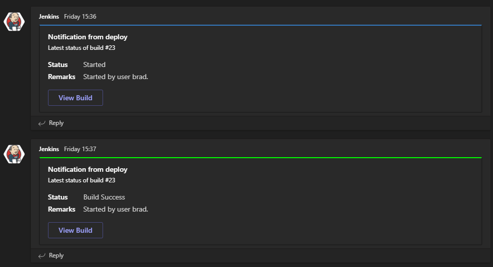

---
## __Review__
### __Risk Assessment__
Once the development process was complete, I reviewed the risk assessment to talk about the new likelihood and impact of risks.

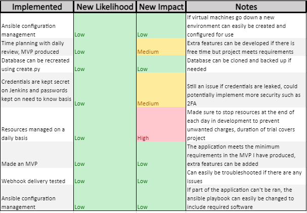

### __App Review__
The application API got minor edits from the initial design to be simpler to implement while still having the same functionality I intended the application to have, and make it easier to iterate on in the future if needed.

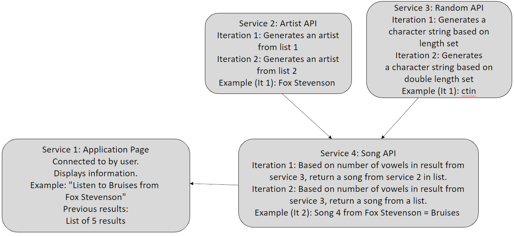

### __CI-Pipeline Review__
I managed to mostly implement the CI pipeline I initially designed, other than getting jenkins to run the ansible playbook, as I ran into some errors while trying to implement this and didn't have the time to troubleshoot it. However this would have been an extra feature and so I decided it would be something I could revisit in the future.

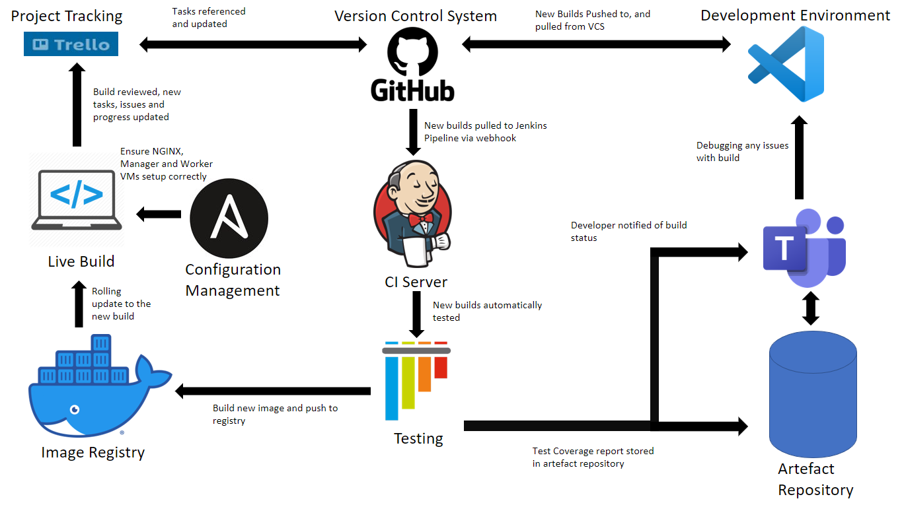

### __Conclusion__
In conclusion, the application meets the requirements set in the project brief, and the implementation using Jenkins is functional, allowing for rolling updates when new iterations and features are added. I made small changes during the development to make the application easier to iterate on in the future, and followed best practices where I could with the various tools used during development and deployment of the application.

In the future I would like to add more functionality to the app and make it usable, rather than just a technical demo to use with the CI pipeline I developed.

---
__Author:__ Bradley Dobson
---
